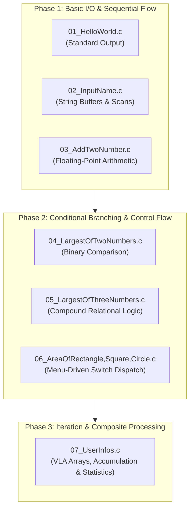

# CET MCA Semester 1 C Programming Lab

*Foundational C programming and problem-solving laboratory coursework for First Semester MCA students at College of Engineering Trivandrum (CET).*

<!-- shieldcn-start -->
<p align="center">
  <a href="#"></a>
  <a href="#"></a>
</p>
<!-- shieldcn-end -->

---

## Lab Architecture & Curriculum Roadmap

The laboratory coursework progresses from fundamental terminal I/O and procedural logic to branching conditionals, data arrays, and structured computational routines:



---

## Program Index

| Program | Core Concept | Description |
| :--- | :--- | :--- |
| [`01_HelloWorld.c`](./01_HelloWorld.c) | Console Output | Initializes program execution and prints text to standard output (`stdout`). |
| [`02_InputName.c`](./02_InputName.c) | String I/O | Reads formatted string input into a character buffer and displays greetings. |
| [`03_AddTwoNumber.c`](./03_AddTwoNumber.c) | Arithmetic Operations | Accepts double-precision floating-point inputs and computes their sum. |
| [`04_LargestOfTwoNumbers.c`](./04_LargestOfTwoNumbers.c) | Relational Logic | Compares two numeric values using `if-else` branching to identify the maximum. |
| [`05_LargestOfThreeNumbers.c`](./05_LargestOfThreeNumbers.c) | Multi-Condition Evaluation | Evaluates three numbers using compound logical operators (`&&`). |
| [`06_AreaOfRectangle,Square,Circle.c`](./06_AreaOfRectangle,Square,Circle.c) | Switch Selection | Computes geometric surface areas based on interactive user shape selection. |
| [`07_UserInfos.c`](./07_UserInfos.c) | Loops & Array Accumulation | Collects student marks into an array, calculates totals, averages, percentages, and eligibility status. |

---

## Compilation & Execution

All programs are written in standard C (C99/C11 compatible) and can be compiled using `gcc` or `clang`.

### Step 1: Compile

Run the compiler on the target source file:

```bash
gcc -Wall -Wextra -std=c11 01_HelloWorld.c -o 01_HelloWorld
```

### Step 2: Run

Execute the compiled binary directly in the terminal:

```bash
./01_HelloWorld
```

### Batch Build (Optional)

To compile all source files in one pass:

```bash
for file in *.c; do
  gcc -Wall -std=c11 "$file" -o "${file%.c}"
done
```

---

## Execution Walkthrough

### Example 1: Menu-Driven Area Calculator (`06_AreaOfRectangle,Square,Circle.c`)

```text
Please Enter What You Want To Find Area Of
If Circle Then Type C
If Rectangle Then Type R
If Square Then Type S
R
Enter length: 12.5
Enter width: 4.0
Area of Rectangle = 50.000000
```

### Example 2: Student Marks and Eligibility Processor (`07_UserInfos.c`)

```text
Enter Your Name: Ashfakh
Enter Your Age: 21
Enter Number Of Subjects You Have: 3
Enter marks for Subject 1: 85
Enter marks for Subject 2: 90
Enter marks for Subject 3: 95

----- Details -----
Name: Ashfakh
Age: 21
Number of Subjects: 3
Total Marks: 270
Average Marks: 90.000000
Percentage: 90.000000

As You're age is 18 and Equal Aged You are Eligible to vote
```

---

## Repository Structure

```text
.
├── 01_HelloWorld.c                       # Basic Hello World program
├── 02_InputName.c                        # String buffer reading
├── 03_AddTwoNumber.c                     # Double-precision addition
├── 04_LargestOfTwoNumbers.c              # Two-variable comparison
├── 05_LargestOfThreeNumbers.c            # Three-variable comparison
├── 06_AreaOfRectangle,Square,Circle.c   # Menu-driven shape area calculator
├── 07_UserInfos.c                        # Student records and mark aggregation
└── README.md                             # Coursework index and lab guide
```
